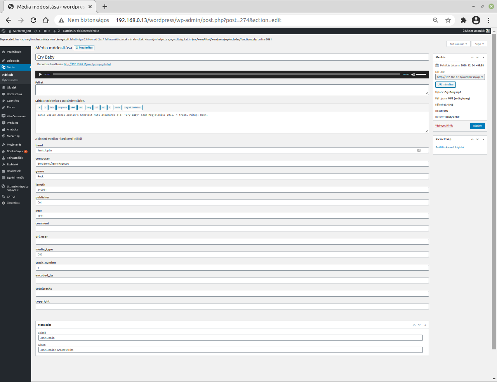

# mp3ext_extension wordpress bővítmény

Current Version:1.0.0

## Licensz: GNU/GPL

A wordpress alapértelmezett media kezelője a feltöltött mp3 fájlokkal kapcsolatban a következő adatokat kezeli:

    • Cím
    • Előadó
    • Album
    • Felirat
    • Leírás
    • Feltöltő
    • Fájl URL

### Az mp3_extension plugin ezeket az admin oldalon adatokat kiegészíti az mp3 fájlokban lévő további adatokkal:

    • artist   - előadó
    • band   - zenekar
    • composer  - szerző
    • genre  - müfaj (lásd: https://en.wikipedia.org/wiki/ID3 )
    • year – év
    • comment – megjegyzés
    • fileformat
    • filename
    • filesize
    • mime_type
    • playtime (játszási idő hh:mm:ss)

Valamint; ha a feltöltött mp3 fájlok bármelyike ezeken kívül más információkat is tartalmaz akkor azokkal is kibővül a kezelt adat mennyiség, az így kezelésbe vont extra adatok a már meglévő többi mp3 fájlnál megjelennek, értelemszerűen üres tartalommal, de szükség esetén az adminisztrátor kitöltheti őket.

A kezelt adatok a media kezelő admin felületén jelennek meg.
A fájl feltöltésekor a plugin kiolvassa a fájlban tárolt adatokat és ACF fieldekben adatbázisban tárolja. Az adminisztrátor a wordpress admin felületen a media kezelőben módosíthatja az adatokat, a modosítás a wordpress adatbázisban kerül tárolásra, az mp3 fájlban tárolt adatok nem változnak. Az admin felületen ilyenkor a módosított adatok láthatóak.
A szükséges ACF fieldeket és ACF groupot s szoftver automatikusan létrehozza.
Az ACF group neve: „mp3-extended” 

A plugin az mp3 fájlokban lévő „comments”, „tags[id3v2]”, „tags[idv3v1]”, „fileformat”, „filename”, „filesize”, „playtime” , „mimetype” adatokat dolgozza fel.
Ha az mp3 fájl redundánsan tartalmazza az adatokat akkor a következő prioritás érvényesül:

    1. id3v2
    2. id3v1
    3. comments
    
A plugin neve: „mp3-extension” a plugin által használt name prefix:  „mp3ext_”

A plugin a 

getID3() by James Heinrich <info@getid3.org>               
available at http://getid3.sourceforge.net                 
           or https://www.getid3.org                        
          also https://github.com/JamesHeinrich/getID3  

szoftverkönyvtár felhasználásával készül, annak licenc feltételeit figyelembe véve, a felhasználás módjától függően szükség lehet  licenc megvásárlására.
Lásd a fenti web címeken.

## Szükséges szoftver környezet:

- PHP 4.2.0 up to 5.2.x for getID3() 1.7.
- wordpress CMS
- advanced-custom-fields plugin

## Telepítés a WP plugin telepítővel
- A https://github.com/utopszkij/mp3_extension web helyről, a "code" gombra kattintva, najd a "Download zip" linket használva töltsd le a zip fájlt,  
- A Wordpress plugin telepítővel telepitsd ezt a zip fájlt 
- Plugin kezelőben kapcsold be a plugint.

## Kézi telepítés
- hozz létre a wp-conetent/plugin könyvtárba egy új mp3_extension nevü könyvtárat
- ebbe másold be a repo tartalmát
- Plugin kezelőben kapcsold be a plugint.

## Automatikus frissités
- kapcsold be a WP admin felületen, a plugin automatikus frissitési lehetőségét

## Kézi Frissítés
- A https://github.com/utopszkij/mp3_extension web helyről, a "code" gomra kattintva, majd a "Download zip" linket használva töltsd le a zip fájlt, 
- A wordpress Plugin kezelőben kapcsold ki a plugint, majd távolisd el,
- Újra telepítés a friss zip -fájlt használva (lásd fentebb),
     
Szerző: Fogler Tibor RoBIT Bt

github updater: https://github.com/radishconcepts/WordPress-GitHub-Plugin-Updater felhasználásával készült.

github.com/utopszkij

tibor.fogler@gmail.com
